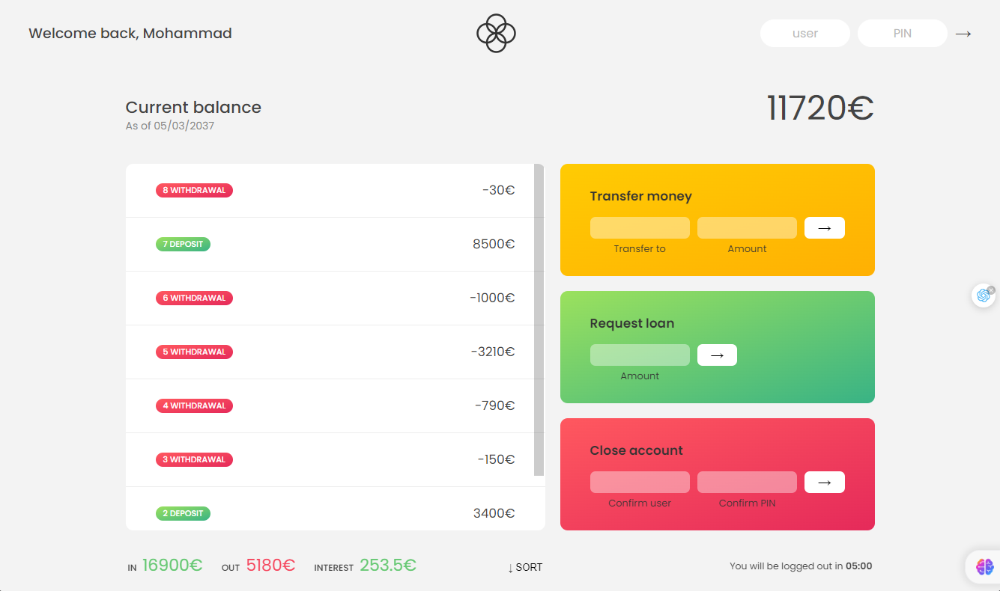

# Bank List 

## Options
- Using vite.js 
- Using json format 
- Transfer Money
- Close account 

## How to run roject ?
1. open project folder on vscode
2. open terminal 
3. enter " **npm i** " command
4. enter " **npm run dev** command"

### [Live Demo](https://m-sadegh86.github.io/Bank-List)